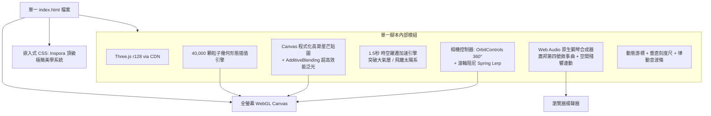
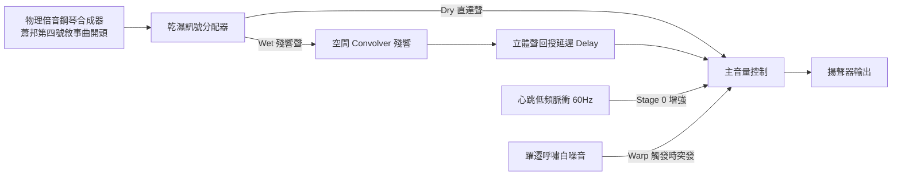

# 「Cosmic Drift: 宇宙漂移」粒子互動視覺與音效單頁應用
## 功能與技術規格書 (System Specification) - v2.1 (v2.1 版本)

---

## 1. 專案願景與核心哲學 (Vision & Philosophy)

本專案是一款以**單一 HTML 檔案封裝**的「Awwwards 級沉浸式 3D 粒子視聽互動藝術」單頁應用。
融入 **Inspora** 與 **Refero Styles** 的頂級極簡設計語言（膠囊式磨砂玻璃 HUD、電影級微膠卷噪點、動態磁吸微光游標），讓使用者從一間寧靜房間中躺在床上的微光小人出發，隨著視角向上攀升，經歷穿透大氣層、俯瞰地球、跨越太陽系、觀覽銀河旋臂，直到抵達宏觀宇宙網狀纖維；最終藉由「銜尾蛇（Ouroboros Loop）」哲學設計，億萬宇宙纖維網絡如深吸一口氣般溫柔收攏凝聚回最初小人的心跳，達成「個體即宇宙，宇宙即個體」的無限輪迴。

背景音樂採用瀏覽器純程式碼物理倍音即時合成的**蕭邦《第四號敘事曲》（Chopin: Ballade No. 4, Op. 52）經典開頭（Andante con moto）**，隨視角升空化作星塵般的幽遠空間殘響，帶來極具詩意與心靈療癒的冥想旅程。

---

## 2. 運行環境與技術限制 (Constraints & Environment)

* **執行環境**：現代主流瀏覽器（Chrome, Edge, Safari, Firefox 最新版），支援 WebGL 1.0/2.0 與 Web Audio API。
* **零構建流程 (Zero-build)**：不使用 Node.js、Vite 等打包工具，全程式碼封裝於單一 `index.html`，可本機雙擊執行，放入 GitHub Pages 即可秒開。
* **零外部多媒體資源 (Zero External Assets)**：
  * **無外掛 3D 模型 (.obj / .gltf)**：全部由演算法生成點陣空間幾何。
  * **無外掛音訊檔 (.mp3 / .wav)**：由 Web Audio API 物理倍音合成古典鋼琴與深空氛圍。
  * **無外掛圖檔**：粒子貼圖由記憶體中的原生 Canvas 即時繪製；電影噪點濾鏡由純 CSS/SVG 演算法產生。
* **超高效能保證 (Guaranteed 60 FPS)**：
  * **捨棄重型後期處理**：不使用吃顯卡效能的 Full-screen `UnrealBloomPass`，改採 **Canvas 高斯漸層星芒貼圖 ＋ `THREE.AdditiveBlending`（加法混色疊加）**。
  * 全程維持在 **單一 Draw Call**，即使在輕薄文書筆電與行動裝置上，依然極致絲滑穩定 60 FPS。
* **依賴管理**：全數使用公共 CDN 載入：
  * **3D 引擎**：Three.js (r128)
  * **相機控制器**：OrbitControls.js

---

## 3. 系統架構與資料流 (System Architecture & Data Flow)

---

## 4. 粒子系統與六大尺度演算法 (Scale Morphing Engine)

系統維持總數 **40,000 顆發光粒子**（`THREE.BufferGeometry`），透過全域連續尺度參數 $P \in [0.0, 6.0)$ 進行座標 $(x,y,z)$ 與色彩 $(r,g,b)$ 的無縫平滑插值（Lerp）：

| 尺度階段 | 尺度進度 $P$ | 物理尺度 | 視覺對象與粒子動態 | 幾何模型與色彩定義 |
| :--- | :--- | :--- | :--- | :--- |
| **Stage 0** | $0.0 \sim 1.0$ | $10^0\text{ m}$ | **房間與安睡的小人** | 躺在床上的安詳人體輪廓；胸口心臟核心為發光紅金粒子，維持 $1.0\text{ Hz}$ 規律脈衝明暗跳動；床榻邊框與室內懸浮微塵。 | 暖金／月白色人體、深青灰床鋪、赤金色心臟脈衝 |
| **躍遷 1** | $1.0 \to 1.5$ | 跨越層 | **【突破大氣層時空躍遷】** | **觸發 1.5 秒強制時空加速衝刺**，粒子順著相機運動方向拉伸為光速流星拖尾，伴隨大氣破空呼嘯聲。 | 金橙地表漸變為冰藍與白光流線 |
| **Stage 1** | $1.5 \sim 2.0$ | $10^5\text{ m}$ | **大氣層與夜景地表** | 人體與房間收縮為原點微光；地表城市燈火展開，大氣對流雲層呈對數螺旋擴散。 | 暖橘城網、極光淡紫與大氣薄藍 |
| **Stage 2** | $2.0 \sim 3.0$ | $10^7\text{ m}$ | **旋轉地球** | 依球座標公式分布於球面上（$R=60$），伴隨 $23.5^\circ$ 自轉軸平穩自轉，邊緣呈現大氣微光圈。 | 蔚藍海洋、翡翠陸緣、晶白雲卷 |
| **Stage 3** | $3.0 \sim 3.5$ | $10^{12}\text{ m}$ | **太陽系黃道面** | 地球縮為微弱藍點；中心為耀眼太陽光核，水金地火木土天海八大行星同心橢圓公轉軌道環舒展。 | 金黃太陽星核、天青與銀白軌道環 |
| **躍遷 2** | $3.5 \to 4.0$ | 跨越層 | **【飛離太陽系時空躍遷】** | **觸發 1.5 秒深空躍遷衝刺**，柯伊伯帶小行星粒子向兩側飛掠拉伸，光年級空間跨越。 | 軌道微塵拉長為深空流光 |
| **Stage 4** | $4.0 \sim 5.0$ | $10^{21}\text{ m}$ | **雙懸臂螺旋銀河** | 依照對數螺旋公式 $r = a \cdot e^{b\theta}$ 排列，中央為高密度璀璨星核，兩條巨型旋臂向外舒展。 | 星核紫粉金光、懸臂鈷藍與銀白星團 |
| **Stage 5** | $5.0 \sim 6.0$ | $10^{26}\text{ m}$ | **宇宙網狀纖維 (Cosmic Web)** | 依 3D 引力絲狀節點演算法分布，展現宏觀宇宙纖維網與巨大宇宙空洞（Cosmic Voids）。 | 幽秘深青、紫白超星系團輝光 |
| **銜尾蛇** | $6.0 \to 0.0$ | 閉環 | **溫柔凝聚歸一 (Ouroboros)** | 億萬星系纖維如深吸一口氣般緩慢收攏至中心點，視野柔和滑入小人的心跳微光，循環無縫重啟。 | 宇宙纖維向中心匯聚，凝結為心臟赤金微光 |

---

## 5. 視角控制器與動力學規格 (Camera & Warp Dynamics)

### 5.1 雙層鏡頭控制
1. **深度縮放控制 (Depth Zoom)**：
   - 使用者透過**滑鼠滾輪**（或觸控手勢）推拉尺度進度 $P$。
   - 採用彈簧阻尼平滑插值（Spring Lerp）：
     $$P_{\text{current}} = P_{\text{current}} + (P_{\text{target}} - P_{\text{current}}) \times 0.06$$
     手感極其滑順，無任何頓挫跳躍。
2. **自由環視控制 (360° Orbit)**：
   - 按住**滑鼠左鍵拖曳**可 360° 自由環視旋轉，在任何尺度（房間、地球、太陽系、銀河、宇宙網）皆可自由變換角度欣賞。
   - 滑鼠右鍵可進行微幅視角平移。

### 5.2 特定節點時空躍遷引擎 (Warp Rush Trigger)
- 當尺度跨越 $P=1.0$（突破大氣層）及 $P=3.5$（飛離太陽系）時，系統觸發為期 **1.5 秒的時空躍遷衝刺**：
  - 鏡頭推進速度短暫提升。
  - 著色運算將粒子沿相機視線向量動態拉伸為流光線條（Velocity Streak）。
  - 1.5 秒衝刺完畢後，平滑恢復為點狀星塵形態。

### 5.3 自動漫遊巡航 (Auto-Drift Mode)
- **觸發方式**：按下鍵盤 `空白鍵 (Space)` 或點擊右上角膠囊按鈕。
- **運鏡節奏**：以恆定慢速前進（$\Delta P \approx 0.0008$ / 幀），相機緩慢自轉（$\Delta \theta \approx 0.001$ rad / 幀），宛如冥想屏保。手動滾動滾輪可無縫接管操作。

---

## 6. Web Audio 程序化鋼琴與空間殘響系統 (Audio Engine)

> [!IMPORTANT]
> 遵守瀏覽器安全機制，首頁設有「點擊任意處啟程」遮罩，首次點擊即同步解鎖 AudioContext。

1. **物理倍音鋼琴合成器 (Physical Harmonic Piano Synth)**：
   - 每個鋼琴音符由 4 組正弦波諧波振盪器（基頻 $f_0$、2倍 $2f_0$、3倍 $3f_0$、4倍 $4f_0$）組合而成。
   - 具備真實鋼琴敲擊起音（Attack 0.005s）與長尾自然指數衰減（Decay 2.5s ~ 4.0s）。
   - 內建演奏蕭邦《第四號敘事曲》（Op. 52）開頭樂段（Andante con moto）：由舒緩敲響的溫柔 G 音開始，悠然鋪陳出如詩如夢的下行旋律。
2. **空間擴散殘響連動機制 (Spatial Audio Diffusion)**：
   - **房間階段 ($P \approx 0$)**：乾聲比例 90%，殘響比例 10%，鋼琴聲清澈、溫暖、近距離。
   - **升空至宇宙 ($P \to 5$)**：殘響與延遲比例平滑提升至 85%，乾聲衰退，音色逐漸空靈、幽遠、深邃，彷彿鋼琴聲化作了星塵回音在無垠星海中迴盪。
   - **銜尾蛇循環重置 ($P \to 0$)**：殘響收斂，清澈溫暖的原版主題重新在小人耳畔響起。
3. **輔助動態音效**：
   - 心臟搏動低頻（Stage 0 沉穩 Lub-Dub 脈衝）。
   - 兩次 1.5 秒時空躍遷時的大氣氣流帶通掃頻破空聲。

---

## 7. Awwwards / Inspora 風格極致 UI 與微互動 (Visual & Micro-Interactions)

本章節為 **v2.1 版本重點導入**之頂級國際網頁設計語言：

### 7.1 電影級純代碼膠卷微噪點 (Film Grain Overlay)
* 採用純 CSS / 原生 SVG Filter 生成動態微小噪點覆蓋層（透明度約 3.5%）。
* **無外部圖檔、不吃 GPU**，徹底打破純 WebGL 的生硬平滑感，注入《星際效應》式的膠卷顆粒電影質感。

### 7.2 高級感自訂微動態游標 (Dynamic Magnetic Cursor)
* 隱藏系統預設滑鼠指標，替換為具備平滑物理延遲追蹤的半透明微光光環：
  * **靜止／滑動**：柔和小光環，隨滑鼠位置優雅漂移。
  * **按住拖曳（環視）**：光環微幅向內收斂，伴隨淡藍光暈，浮現微小等寬文字 `[ ROTATE ]`。
  * **滾動滾輪（縮放）**：游標向外泛出極微弱的擴散波紋圈。

### 7.3 音效律動動態等化器圖示 (Live Equalizer Bars)
* 右上角音效開關由傳統按鈕升級為 **4 根垂直微光音波條（Bars）**：
  * 當蕭邦鋼琴彈奏時，音波條依頻率與音符動態起伏跳動。
  * 點擊靜音時，平滑收攏為一條水平微弱細線。

### 7.4 懸浮磨砂玻璃膠囊 HUD (Glassmorphism Pill UI)
* **視覺風格**：採用 `backdrop-filter: blur(16px)`、深邃暗黑磨砂底色（`rgba(10, 15, 30, 0.4)`）與 $1\text{px}$ 半透明微弱邊框。
* **字體排版**：採用頂級字體排版規範，等寬字體（Monospace）、高字距（`letter-spacing: 0.18em`）與科技簡約大小寫混排。
* **自動隱藏**：點擊啟動後 HUD 顯示 3 秒隨後自動淡出；當偵測到滑鼠移動、點擊或滾輪滾動時，0.3 秒內浮現，靜止 2 秒後再次平滑隱藏。

### 7.5 右側極細垂直尺度刻度尺 (Vertical Scale Scrubber)
* 螢幕右側呈現一條極細（$1\text{px}$）半透明垂直標尺，標記六大尺度節點：
  - `ROOM` ($10^0\text{ m}$)
  - `ATMOS` ($10^5\text{ m}$)
  - `EARTH` ($10^7\text{ m}$)
  - `SOLAR` ($10^{12}\text{ m}$)
  - `GALAXY` ($10^{21}\text{ m}$)
  - `COSMOS` ($10^{26}\text{ m}$)
* 發光游標隨著尺度進度 $P$ 沿標尺平滑滑移，支援點擊直接平滑導航至特定尺度。

---

## 8. 專案交付與驗收標準 (Deliverables & Acceptance Criteria)

1. **交付物**：單一檔案 `index.html`。
2. **極限測試**：
   - 開啟「自動巡航」時，10 分鐘內必須能流暢循環三次以上且不崩潰、無記憶體洩漏。
   - 離線環境（除 CDN 初始載入外）完全正常運算與發聲。
3. **體驗指標**：
   - 40,000 顆粒子 + 膠卷噪點濾鏡全程維持 $\ge 55 \sim 60\text{ FPS}$。
   - 滾輪推拉、360° 拖曳旋轉、自訂磁吸游標均具備航太級平滑慣性。
   - 兩次 1.5 秒時空躍遷流光震撼、銜尾蛇閉環溫柔銜接。
   - 蕭邦鋼琴開頭旋律隨高度產生幽遠空間殘響連動，音波條即時動態跳動。
